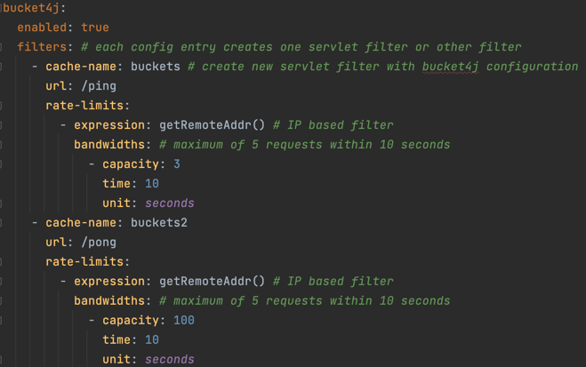
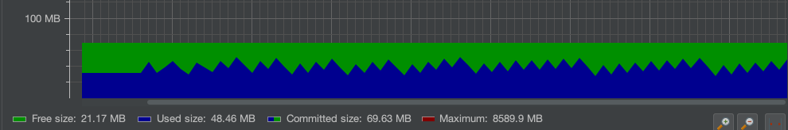
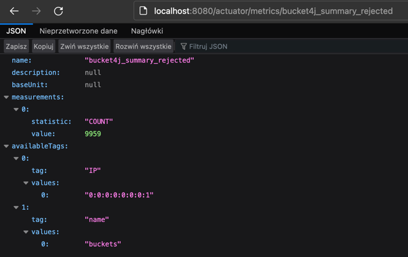

## Implementation and configuration

We don't have to write additional code. Configuration and additional dependencies are enough. 

### Configuration with Redis

```
<dependency>
    <groupId>com.giffing.bucket4j.spring.boot.starter</groupId>
    <artifactId>bucket4j-spring-boot-starter</artifactId>
    <version>0.7.0</version>
</dependency>
<dependency>
    <groupId>org.springframework.boot</groupId>
    <artifactId>spring-boot-starter-cache</artifactId>
</dependency>
<dependency>
    <groupId>org.springframework.boot</groupId>
    <artifactId>spring-boot-starter-data-redis-reactive</artifactId>
</dependency>
```

```
spring:
  cache:
    type: redis
```

### Configuration with Caffeine
```
<dependency>
    <groupId>com.giffing.bucket4j.spring.boot.starter</groupId>
    <artifactId>bucket4j-spring-boot-starter</artifactId>
    <version>0.7.0</version>
</dependency>
<dependency>
    <groupId>org.springframework.boot</groupId>
    <artifactId>spring-boot-starter-cache</artifactId>
</dependency>
<dependency>
    <groupId>javax.cache</groupId>
    <artifactId>cache-api</artifactId>
</dependency>
<dependency>
    <groupId>com.github.ben-manes.caffeine</groupId>
    <artifactId>caffeine</artifactId>
    <version>3.1.1</version>
</dependency>
<dependency>
    <groupId>com.github.ben-manes.caffeine</groupId>
    <artifactId>jcache</artifactId>
    <version>3.1.1</version>
</dependency>
```

```
spring:
  cache:
    type: caffeine
    cache-names: # these names should be corresponding with buckets in bucket4j section as below
      - buckets
      - buckets2
    caffeine:
      spec: maximumSize=100000,expireAfterAccess=3600s
```

## Benchmark


For above configuration there are attached AB (Apache Benchmark) test results for:
a) in-memory Caffeine cache for rate limiting
b) Redis-based rate limiting
Both solutions use Bucket4J library for implementation of rate limiting feature.
For comparison there is also attached benchmark for approach when we have simple endpoint without any rate limiting.
Command used for testing:
```
ab -n 10000 -c 10 localhost:8080/ping
```

### No rate limiting


### Results using in-memory 


### Results using Redis


## Memory

To check memory usage of both approaches I use JProfiler tool and change rate limiting key from IP to header
`X-api-key`. Test steps:
1. The application was run with JProfiler 
2. To generate a traffic below script was run
```
while [ true ] ; do curl -H "X-api-key: `uuidgen`" localhost:8080/ping -i;done
```
Each `X-api-key` is random so we can simulate in this way unique requests.
3. To simulate DoS attack below command was run
```
for i in {1..10000} ; do curl -i -H "X-api-key: 321D4DF5-13BD-4912-97AF-497239534C62" localhost:8080/ping -sS |grep HTTP; done
```
### Application memory usage for rate limiting with Caffeine (max cache size: 100000)


### Application memory usage for rate limiting with Redis



Results from `docker stats redis` after 40 minutes generating random uuids


## How can we enable this feature

We can simply define if rate limiting feature should be enabled or disabled for
specific environment using configuration property as below:

```
bucket4j:
  enabled: true
```

## How can we handle endpoint with more complex syntax

Is it possible to define them using regular expressions.

```
bucket4j:
enabled: true
filters:
- cache-name: buckets
  url: /accounts/<regexp_for_uuid>/profiles/<regexp_for_uuid>
```

## Metrics
This project automatically provides metric information about the consumed and rejected buckets. 
You can extend these information with configurable custom tags like the username or the IP-Address which can then be evaluated in a monitoring system 
like prometheus/grafana.
```
bucket4j:
enabled: true
filters:
- cache-name: buckets
  filter-method: servlet
  filter-order: 1
  url: .*
  metrics:
    tags:
      - key: IP
        expression: getRemoteAddr()
        types: REJECTED_COUNTER # for data privacy reasons the IP should only be collected on bucket rejections
      - key: USERNAME
        expression: "@securityService.username() != null ? @securityService.username() : 'anonym'"
      - key: URL
        expression: getRequestURI()
  rate-limits:
    - execute-condition:  "@securityService.username() == 'admin'"
      expression: "@securityService.username()?: getRemoteAddr()"
      bandwidths:
        - capacity: 30
          time: 1
          unit: minutes        
```

Metrics as:

* bucket4j_summary_consumed
* bucket4j_summary_rejected 

can be exposed and give such info as here:

